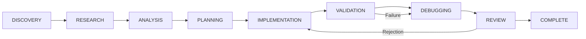

# ⚡ AGY CLI Skill & EAF Orchestrator

[](https://github.com/karthikeyanV2K/agy-cli-skill)
[](#-1-click-installation-all-os)
[](LICENSE)

An enterprise-grade autonomous orchestration skill for **Google Antigravity (AGY CLI)**. Equips your coding assistant with the **Enterprise Agent Framework (EAF)**, enforcing 10 Core Engineering Laws, strict permission boundaries, and structured multi-agent state machine execution via the `/EAF <Prompt>` command.

---

## 🚀 1-Click Installation (All OS)

Choose your operating system to automatically install the skill and configure the `/EAF` command:

### 🪟 Windows (PowerShell)
```powershell
powershell -ExecutionPolicy Bypass -Command "irm https://raw.githubusercontent.com/karthikeyanV2K/agy-cli-skill/main/install.ps1 | iex"
```

*Or direct inline execution:*
```powershell
& { $s="$HOME\.gemini\config\skills\agy-cli-skill"; $r="$HOME\.gemini\config\rules"; New-Item -ItemType Directory -Force -Path $s,$r,".gemini\skills",".gemini\rules"|Out-Null; if(Test-Path "$s\.git"){git -C $s pull}else{git clone https://github.com/karthikeyanV2K/agy-cli-skill.git $s}; @'
# EAF Orchestrator Protocol Rule
When the user starts a request with `/EAF`, activate the Enterprise Agent Framework (EAF) Orchestrator Mode.
1. Classify task (BUG, FEATURE, REFACTOR, PERFORMANCE, SECURITY, ARCHITECTURE).
2. Execute state machine: DISCOVERY -> RESEARCH -> ANALYSIS -> PLANNING -> IMPLEMENTATION -> VALIDATION -> REVIEW -> COMPLETE.
3. Enforce AGENTS.md Engineering Laws 1-10 (Never blindly code, Knowledge states, Decision Ledger, Adversarial Review).
'@ | Out-File -Encoding utf8 "$r\eaf-orchestrator.md"; Copy-Item -Force "$r\eaf-orchestrator.md" ".gemini\rules\eaf-orchestrator.md"; Write-Host "`n Setup Complete! Use: /EAF <Prompt>" -ForegroundColor Green }
```

### 🐧 Linux & 🍎 macOS (Bash / Zsh)
```bash
curl -fsSL https://raw.githubusercontent.com/karthikeyanV2K/agy-cli-skill/main/install.sh | bash
```

*Or direct inline execution:*
```bash
bash -c 'SKILL_DIR="$HOME/.gemini/config/skills/agy-cli-skill"; RULE_DIR="$HOME/.gemini/config/rules"; mkdir -p "$SKILL_DIR" "$RULE_DIR" .gemini/skills .gemini/rules; if [ -d "$SKILL_DIR/.git" ]; then git -C "$SKILL_DIR" pull; else git clone https://github.com/karthikeyanV2K/agy-cli-skill.git "$SKILL_DIR"; fi; cat << "EOF" > "$RULE_DIR/eaf-orchestrator.md"
# EAF Orchestrator Protocol Rule
When the user starts a request with `/EAF`, activate the Enterprise Agent Framework (EAF) Orchestrator Mode.
1. Classify task (BUG, FEATURE, REFACTOR, PERFORMANCE, SECURITY, ARCHITECTURE).
2. Execute state machine: DISCOVERY -> RESEARCH -> ANALYSIS -> PLANNING -> IMPLEMENTATION -> VALIDATION -> REVIEW -> COMPLETE.
3. Enforce AGENTS.md Engineering Laws 1-10 (Never blindly code, Knowledge states, Decision Ledger, Adversarial Review).
EOF
cp "$RULE_DIR/eaf-orchestrator.md" .gemini/rules/eaf-orchestrator.md
echo -e "\n\033[0;32m Setup Complete! Use: /EAF <Prompt>\033[0m"'
```

---

## 🎯 How to Use

Once installed, simply start your task prompt with `/EAF` inside your AGY session:

```bash
/EAF Implement JWT authentication with Redis token blacklisting and rate limiting
```
```bash
/EAF Fix memory leak and high CPU usage in worker queue
```
```bash
/EAF Refactor database connection pool to support multi-region failover
```

---

## 🧠 EAF Orchestration Engine

When `/EAF` is triggered, AGY switches from standard chat into Strict Orchestrator Mode:

### 1. Task Classification & Routing

Every task is automatically classified and routed through dedicated agent pipelines:

| Task Type | Assigned Pipeline |
| :--- | :--- |
| **BUG** | `CODEBASE` ➔ `DEBUGGER` ➔ `TESTER` ➔ `REVIEWER` |
| **FEATURE (Internal)** | `CODEBASE` ➔ `ARCHITECT` ➔ `IMPLEMENTER` ➔ `TESTER` ➔ `REVIEWER` |
| **FEATURE (External API)** | `RESEARCHER` ➔ `CODEBASE` ➔ `ARCHITECT` ➔ `IMPLEMENTER` ➔ `TESTER` ➔ `REVIEWER` |
| **REFACTOR** | `CODEBASE` ➔ `ARCHITECT` ➔ `IMPLEMENTER` ➔ `TESTER` ➔ `REVIEWER` |
| **PERFORMANCE** | `RESEARCHER` ➔ `CODEBASE` ➔ `ARCHITECT` ➔ `IMPLEMENTER` ➔ `TESTER` ➔ `DEBUGGER` ➔ `REVIEWER` |
| **SECURITY** | `RESEARCHER` ➔ `CODEBASE` ➔ `ARCHITECT` ➔ `SECURITY_REVIEW` ➔ `IMPLEMENTER` ➔ `TESTER` ➔ `REVIEWER` |
| **ARCHITECTURE CHANGE** | `RESEARCHER` ➔ `CODEBASE` ➔ `ARCHITECT` ➔ `SECURITY_REVIEW` ➔ `IMPLEMENTER` ➔ `TESTER` ➔ `DEBUGGER` ➔ `REVIEWER` |

---

### 2. State Machine Enforcement

Transitions sequentially with strict gating:



---

### 3. The 10 Core Engineering Laws

1. **Never Blindly Code**: Mandatory codebase inspection, dependency checking, and flow mapping before editing.
2. **Explicit Knowledge States**: Every assumption classified as `CONFIRMED`, `VERIFIED`, `INFERRED`, or `UNKNOWN`.
3. **Research Before Implementation**: High-impact unknowns block coding until researched.
4. **Decision Ledger**: Every architectural decision requires recorded options, rationale, and tradeoffs.
5. **Adversarial Review**: Passes a 13-point adversarial review (Correctness, Security, Concurrency, Performance, etc.).
6. **Zero Unjustified Hardcoding**: No magic values, fake configs, or environment assumptions.
7. **Disciplined Failure Loops**: Reproduce ➔ Classify ➔ Root Cause ➔ Minimal Patch ➔ Retest.
8. **Final Verification Gate**: Strict pre-completion checklist verification.
9. **Budget Enforcement**: Hard stop limits on research, review, and debug loops.
10. **Evidence-Based "Why"**: Clear evidence justifying why each file, function, and test was modified.

---

## 📁 Repository Structure

```
agy-cli-skill/
├── SKILL.md                 # Skill manifest and triggers
├── AGENTS.md                # Orchestration laws & state machine rules
├── install.ps1              # Windows 1-click installer
├── install.sh               # Linux/macOS 1-click installer
├── README.md                # Documentation & usage guide
├── .gemini/rules/           # EAF Orchestrator rule
└── skills/
    ├── engineering/         # Master workflow gate rules
    ├── research/            # Knowledge gap resolution
    ├── architecture/        # System design & decision ledger
    ├── implementation/      # Clean code & anti-hardcoding
    ├── debugging/           # Failure loop discipline
    ├── testing/             # 6-level test validation
    └── review/              # 13-dimension adversarial review
```

---

## 🛠️ AGY CLI Native Commands

```bash
# Pull external skills directly
agy pull https://github.com/karthikeyanV2K/agy-cli-skill

# List installed skills
agy skill list

# Execute task with explicit skills
agy eaf "your task" --skills engineering,implementation,testing,review

# Dry run mode
agy eaf "your task" --dry-run
```

---

## 📄 License

MIT License © [Karthikeyan](https://github.com/karthikeyanV2K)