<div align="center">

# ⚡ AGY CLI Skill & EAF Orchestrator
### The Autonomous AGI Engineering & Multi-Agent Orchestration Framework for Google Antigravity (AGY CLI)

[](https://github.com/karthikeyanV2K/agy-cli-skill)
[](https://github.com/karthikeyanV2K/agy-cli-skill)
[](#-1-click-quick-installation-all-platforms)
[](LICENSE)

<p align="center">
  <b>Transform your AI coding assistant from a standard chatbot into a disciplined, multi-agent software engineering team.</b>
  <br>
  Enforces 10 Core Engineering Laws, 7-Phase State Machine transitions, 10 Automated Gate checks, and zero-compromise adversarial code reviews via the native <code>/eaf &lt;Prompt&gt;</code> slash command or the standalone <code>agy</code> CLI.
</p>

---

[🚀 Quick Install](#-1-click-quick-installation-all-platforms) • [💡 Usage](#-how-to-use) • [🧠 7-Phase State Machine](#-the-7-phase-eaf-state-machine) • [📜 10 Core Laws](#-10-core-engineering-laws) • [🤖 Multi-Agent Ecosystem](#-multi-agent-ecosystem) • [💻 CLI Commands](#-agy-cli-command-reference)

</div>

---

## 🌟 Why AGY CLI Skill (EAF)?

Most AI coding assistants suffer from **premature coding** — modifying files before understanding repository boundaries, making unvalidated assumptions, and introducing silent regressions.

**AGY CLI Skill (Enterprise Agent Framework / EAF)** replaces chaotic code generation with a structured, battle-tested engineering protocol:

* 🛡️ **Zero Blind Coding**: Mandatory codebase discovery and dependency mapping before any file edits.
* 📋 **Explicit Knowledge States**: Every assumption is classified as `CONFIRMED`, `VERIFIED`, `INFERRED`, or `UNKNOWN`.
* ⚖️ **Immutable Decision Ledger**: Architectural choices require recorded alternatives, trade-offs, and rationale.
* 🔬 **13-Point Adversarial Review**: Automated code security, boundary isolation, error handling, and performance checks.
* 🚦 **10 Hard Gate Checks**: Phase progression is blocked until deterministic verification passes.

---

## 🚀 1-Click Quick Installation (All Platforms)

Run the one-liner for your operating system to automatically clone the skill, build the TypeScript engine, and register the `/eaf` and `/EAF` slash commands:

### 🪟 Windows (PowerShell)
```powershell
powershell -ExecutionPolicy Bypass -Command "irm https://raw.githubusercontent.com/karthikeyanV2K/agy-cli-skill/main/install.ps1 | iex"
```

### 🐧 Linux & 🍎 macOS (Bash / Zsh)
```bash
curl -fsSL https://raw.githubusercontent.com/karthikeyanV2K/agy-cli-skill/main/install.sh | bash
```

### 📦 Standalone Git & NPM Install
```bash
# Clone the repository
git clone https://github.com/karthikeyanV2K/agy-cli-skill.git ~/.gemini/config/skills/agy-cli-skill

# Build TypeScript engine
cd ~/.gemini/config/skills/agy-cli-skill
npm install
npm run build
npm link
```

---

## 🎯 How to Use

### 1. In Antigravity / Gemini CLI Chat Session

Simply start any request with `/eaf`, `/EAF`, or `EAF`:

```text
/eaf Implement JWT authentication with Redis token blacklisting and rate limiting
```
```text
/eaf Fix memory leak and high CPU usage in worker queue
```
```text
EAF Audit Intel WiFi driver DMA descriptors and verify 802.11 active probe framing
```

### 2. In Terminal via `agy` CLI

Execute autonomous engineering tasks directly from your shell:

```bash
# Run full EAF multi-agent task execution
agy task "Build zero-copy async file streaming service with error recovery" --verbose

# Run with explicit EAF framework parameters
agy eaf "Refactor database connection pool for multi-region failover"

# View decision and assumption ledgers
agy decisions
agy assumptions list
```

---

## 🧠 The 7-Phase EAF State Machine

AGY CLI Skill enforces an unbroken sequence of 7 engineering phases. No phase may be skipped, and no code may be written before the architecture gate passes:

```mermaid
flowchart LR
    A[1. DISCOVER<br/><i>Repo Mapping</i>] --> B[2. RESEARCH<br/><i>Gap Resolution</i>]
    B --> C[3. REASON<br/><i>Analysis & Constraints</i>]
    C --> D[4. PLAN<br/><i>Architecture Gate</i>]
    D --> E[5. IMPLEMENT<br/><i>Minimal Patch</i>]
    E --> F[6. VERIFY<br/><i>Automated Tests</i>]
    F --> G[7. REVIEW<br/><i>Adversarial Audit</i>]
    G --> H((COMPLETE))
    
    style A fill:#1976D2,stroke:#0D47A1,color:#fff
    style B fill:#0288D1,stroke:#01579B,color:#fff
    style C fill:#0097A7,stroke:#006064,color:#fff
    style D fill:#7B1FA2,stroke:#4A148C,color:#fff
    style E fill:#F57C00,stroke:#E65100,color:#fff
    style F fill:#388E3C,stroke:#1B5E20,color:#fff
    style G fill:#D32F2F,stroke:#B71C1C,color:#fff
    style H fill:#00C853,stroke:#00E676,color:#fff
```



### Phase Breakdown & Gate Verifications:

| Phase | Core Objective | Deterministic Gate Check |
| :--- | :--- | :--- |
| **1. DISCOVER** | Map repository tree, active configs, and existing patterns | `REPOSITORY_INSPECTED = true` |
| **2. RESEARCH** | Form targeted queries to resolve high-impact unknowns | `ALL_HIGH_IMPACT_GAPS_RESOLVED = true` |
| **3. REASON** | Synthesize constraints, invariants, and assumption ledgers | `ANALYSIS_COMPLETE = true` |
| **4. PLAN** | Produce Architecture Plan with data flow and failure modes | `ARCHITECTURE_GATE = APPROVED` |
| **5. IMPLEMENT**| Produce minimal, surgical code diffs preserving architecture | `IMPLEMENTATION_COMPLETE = true` |
| **6. VERIFY** | Execute compiler checks, unit tests, and regression tests | `BUILD_AND_TEST_PASS = true` |
| **7. REVIEW** | Run 13-point adversarial audit (security, edge cases, leaks) | `ADVERSARIAL_REVIEW_PASSED = true` |

---

## 📜 10 Core Engineering Laws

All agents operating under EAF are bound by these 10 fundamental rules:

1. **Never Blindly Code**: Always inspect existing repository files, structure, and configurations first.
2. **Explicit Knowledge States**: Every assumption must carry `CONFIRMED`, `VERIFIED`, `INFERRED`, or `UNKNOWN`.
3. **Research Before Implementation**: High-impact unknowns strictly block implementation until researched.
4. **Immutable Decision Ledger**: Record every architectural decision with alternatives considered, rationale, and trade-offs.
5. **Zero Unjustified Hardcoding**: No magic values, fake mock URLs, environment-specific paths, or temporary bypasses.
6. **Disciplined Failure Loops**: On test failure: `CLASSIFY ➔ REPRODUCE ➔ ROOT CAUSE ➔ MINIMAL PATCH ➔ RETEST`.
7. **Adversarial Review Required**: 13-point code audit across security, boundary isolation, error handling, and performance.
8. **Preserve System Boundaries**: Never leak cross-project files or touch unapproved workspaces.
9. **Budget Enforcement**: Hard caps on research, review, and debugging iterations to eliminate infinite loops.
10. **12-Point Final Verification**: Complete pre-completion checklist verification before sign-off.

---

## 🤖 Multi-Agent Ecosystem

EAF automatically classifies incoming tasks and dispatches dedicated subagent chains:

```
Task: "Fix DMA timeout on Intel 1000 WiFi ucode upload"
Type: BUG
Routing: [CODEBASE] ➔ [DEBUGGER] ➔ [TESTER] ➔ [REVIEWER]
```

```
Task: "Add OAuth2 PKCE authorization flow with Redis sessions"
Type: FEATURE (External)
Routing: [RESEARCHER] ➔ [CODEBASE] ➔ [ARCHITECT] ➔ [SECURITY] ➔ [IMPLEMENTER] ➔ [TESTER] ➔ [REVIEWER]
```

| Subagent Role | Primary Function | Available Tools |
| :--- | :--- | :--- |
| 👑 **Orchestrator** | Enforces state machine transitions, budgets, and gate checks | Full Management |
| 🏛️ **Architect** | Designs data flow, component boundaries, and mitigations | Read-Only / Planning |
| 💻 **Implementer** | Writes surgical, production-ready code matching plan | File Edit / Build |
| 🐞 **Debugger** | Isolates root causes, reproduces bugs, forms hypotheses | Trace / Diagnostics |
| 🧪 **Tester** | Generates deterministic unit and integration test suites | Test Runners |
| 🛡️ **Reviewer** | Executes 13-point adversarial review and security analysis | Static Analysis / Diff |
| 🔍 **Researcher** | Queries official documentation and resolves knowledge gaps | Web Search / Docs |

---

## 💻 AGY CLI Command Reference

The standalone `agy` CLI provides full management of your autonomous agent workflows:

```bash
Usage: agy [options] [command]

Commands:
  task [options] <desc>     Execute a task through the AGY engineering framework
  eaf [options] <desc>      Execute task through full Engineering Agent Framework
  config [action] [k] [v]   Manage AGY configuration and model parameters
  assumptions [action]      Manage and inspect assumption ledger
  decisions                 Display immutable decision ledger
  pull <sourceUrl>          Pull and install skills from a GitHub repository
  skill <action> [name]     Manage installed skills (list, remove)
  version                   Display version and framework status
  help [command]            Display help for command

Options:
  -v, --version             Display version number
  --verbose                 Enable real-time phase logs & budget tracking
  --dry-run                 Simulate task execution without disk modifications
```

---

## 📊 Live Execution Showcase

When executing tasks under AGY EAF, structured metrics and progress gates are streamed in real time:

```text
════════════════════════════════════════════════════════════
         AGY EAF - Engineering Agent Framework              
  Task: Fix DMA timeout on Intel WiFi ucode upload           
════════════════════════════════════════════════════════════

- Executing DISCOVERY phase...      ✓ Completed
- Executing RESEARCH phase...       ✓ Completed
- Executing ANALYSIS phase...       ✓ Completed
- Executing PLANNING phase...       ✓ Completed
- Executing IMPLEMENTATION phase... ✓ Completed
- Executing VALIDATION phase...     ✓ Completed
- Executing DEBUGGING phase...      ✓ Completed
- Executing REVIEW phase...         ✓ Completed
- Executing COMPLETE phase...       ✓ Completed

▶ Gate Results
──────────────────────────────────────────────────
  ✓ REPOSITORY_INSPECTION     PASSED (120ms)
  ✓ REQUIREMENTS_DECOMPOSITION PASSED (85ms)
  ✓ KNOWLEDGE_GAPS_IDENTIFIED PASSED (210ms)
  ✓ RESEARCH_COMPLETED        PASSED (450ms)
  ✓ ARCHITECTURE_GATE         PASSED (320ms)
  ✓ IMPLEMENTATION_COMPLETE   PASSED (1200ms)
  ✓ BUILD_VERIFICATION        PASSED (180ms)
  ✓ TEST_VERIFICATION         PASSED (340ms)
  ✓ REGRESSION_CHECK          PASSED (210ms)
  ✓ FINAL_REVIEW              PASSED (150ms)

▶ Sign-Off: APPROVED by Orchestrator
✓ ALL 10 GATES & 7 PHASES PASSED
```

---

## 🤝 Contributing

We welcome contributions to the AGY CLI Skill and Enterprise Agent Framework! Please see [CONTRIBUTING.md](CONTRIBUTING.md) for development workflows, test execution guidelines, and subagent contribution protocols.

---

## 📄 License

This project is licensed under the MIT License - see the [LICENSE](LICENSE) file for details.

---

<div align="center">
  <b>Built with ⚡ for the next generation of Autonomous AGI Software Engineering.</b>
  <br>
  <sub>Maintained by <a href="https://github.com/karthikeyanV2K">Karthikeyan</a> • Star ⭐ the repository if you find it useful!</sub>
</div>
