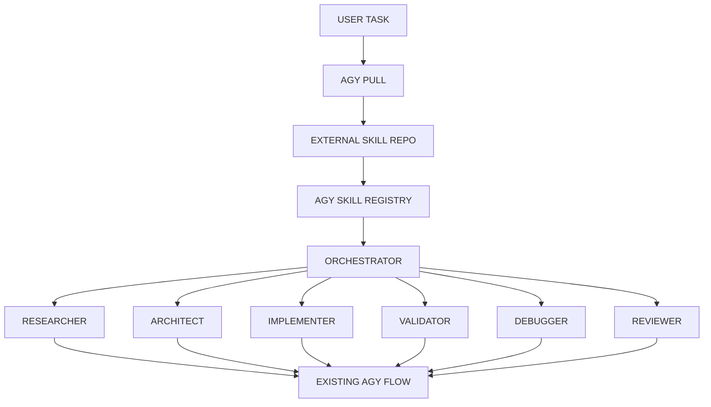
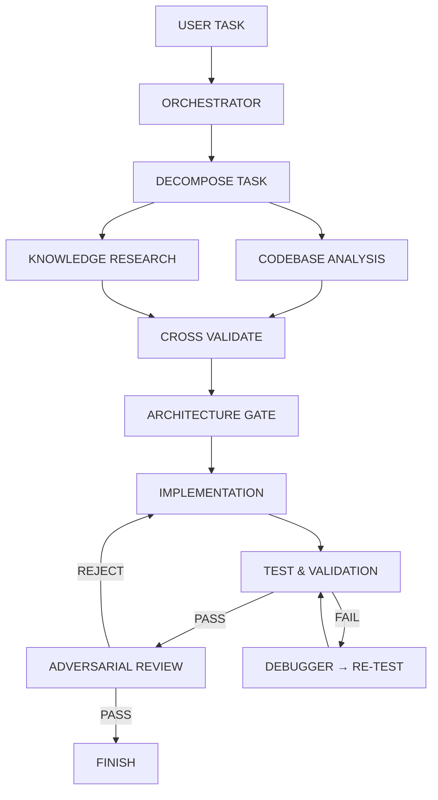

# AGY CLI — Antigravity Engineering Agent Framework

[](https://opensource.org/licenses/MIT)
[](https://github.com/karthikeyanV2K/agy-cli)
[](https://github.com/karthikeyanV2K/agy-cli/stargazers)
[](https://github.com/karthikeyanV2K/agy-cli/issues)
[](https://github.com/karthikeyanV2K/agy-cli/commits/main)
[](https://www.typescriptlang.org/)
[](https://nodejs.org/)

> **AGY CLI** is a production-grade, multi-agent orchestration framework that brings rigorous software engineering discipline to AI-assisted development. Built on a **DISCOVER → RESEARCH → ANALYSIS → PLANNING → IMPLEMENTATION → VALIDATION → DEBUGGING → REVIEW → COMPLETE** pipeline with specialized agents, external skill support, mechanical gate verification, and configurable budgets.

## 🎉 New in v0.1.0: External Skill Integration

```bash
# Pull skills from any GitHub repository
agy pull https://github.com/rmyndharis/antigravity-skills

# Skills automatically inject into AGY engineering flow
agy task "build a Rust driver"
```

Pulled skills become part of AGY's existing agent flow — **no separate skill system**. The skills are injected as agent capabilities/instructions into Researcher, Architect, Implementer, Validator, Debugger, and Reviewer contexts.

---

## 🎯 Why AGY CLI?

Most AI coding tools generate code first, think later. **AGY CLI reverses that** — enforcing a disciplined engineering workflow where **no implementation begins until research, architecture, and knowledge gaps are resolved**.

| Traditional AI Coding | AGY CLI Approach |
|----------------------|------------------|
| ❌ Guess → Code → Debug | ✅ Research → Plan → Implement → Verify |
| ❌ Single model, single prompt | ✅ Specialized agents with distinct permissions |
| ❌ No verification gates | ✅ Mechanical gates: Architecture, Test, Review |
| ❌ Hardcoded assumptions | ✅ Assumption ledger + Decision ledger |
| ❌ "Looks good" reviews | ✅ Adversarial review with REJECT power |
| ❌ Fixed built-in capabilities | ✅ Pull external skills from GitHub |

---

## 🔌 Skill Integration Architecture



**Key principle**: Pulled `SKILL.md` files are treated as **agent capabilities/instructions**, not a new orchestration framework. They inject into the existing engineering state machine.

## 🏗️ Architecture Overview



### Core Principles

| Principle | Description |
|-----------|-------------|
| **DISCOVER → RESEARCH → REASON → PLAN → IMPLEMENT → VERIFY → REVIEW** | Seven-phase engineering lifecycle |
| **No Implementation Before Research Gate** | Knowledge gaps = blocker, not guesswork |
| **Specialized Agent Permissions** | Researcher reads only, Implementer writes, Reviewer rejects |
| **Assumption Ledger** | Every assumption tracked: CONFIRMED / VERIFIED / INFERRED / UNKNOWN |
| **Decision Ledger** | Architectural choices documented with tradeoffs |
| **Configurable Budgets** | Research rounds, review rounds, debug iterations |

---

## 🤖 Agent Roster

| Agent | Role | Permissions | Key Responsibility |
|-------|------|-------------|-------------------|
| **Orchestrator** | Central coordinator | READ, PLAN, SPAWN | Task decomposition, agent assignment, progress monitoring |
| **Researcher** | Knowledge investigator | READ, SEARCH, EXECUTE | Authoritative source lookup, API verification, gap analysis |
| **Architect** | System designer | READ, SEARCH, PLAN | Architecture plans, data/control flow, failure mode analysis |
| **Implementer** | Code producer | READ, WRITE, EXECUTE | Minimal changes, reuse abstractions, no hardcoding |
| **Tester** | Validation engineer | READ, WRITE (tests), EXECUTE | Multi-level validation: format → static → unit → integration → e2e |
| **Debugger** | Root cause analyst | READ, WRITE, EXECUTE | Hypothesis-driven debugging, evidence-based fixes |
| **Reviewer** | Adversarial auditor | READ, SEARCH, EXECUTE, REJECT | 13-category review, can REJECT even with passing tests |

---

## 🛠️ Skill System

| Skill | Purpose |
|-------|---------|
| **Engineering** | Master rules: DISCOVER→RESEARCH→REASON→PLAN→IMPLEMENT→VERIFY→REVIEW |
| **Research** | Targeted knowledge acquisition from authoritative sources |
| **Architecture** | Design gates, data flow, dependency analysis, compatibility |
| **Implementation** | Minimal-change rules, abstraction reuse, anti-hardcoding |
| **Debugging** | CLASSIFY→REPRODUCE→LOCATE→HYPOTHESIZE→PATCH→RETEST |
| **Testing** | Six validation levels with project-appropriate selection |
| **Review** | 13 adversarial categories: correctness, security, performance, etc. |

---

## 🚀 Quick Start

### Prerequisites

- **Node.js 18+** or **Python 3.10+**
- **Git** for version control
- **GitHub CLI (`gh`)** for repository management (optional but recommended)

### Installation

```bash
# Clone the repository
git clone https://github.com/karthikeyanV2K/agy-cli.git
cd agy-cli

# Install dependencies (Node.js)
npm install

# OR install dependencies (Python)
pip install -r requirements.txt
```

### Configuration

Create a `.agyrc` configuration file:

```yaml
# .agyrc
orchestrator:
  model: "claude-4-5-sonnet"
  max_concurrent_agents: 4
  research_budget:
    max_rounds: 3
  review_budget:
    max_rounds: 2
  debug_budget:
    max_iterations: 5

agents:
  researcher:
    permissions: [read, search, execute]
  architect:
    permissions: [read, search, plan]
  implementer:
    permissions: [read, write, execute]
  tester:
    permissions: [read, write:tests, execute]
  reviewer:
    permissions: [read, search, execute, reject]
  debugger:
    permissions: [read, write, execute]

skills:
  - engineering
  - research
  - architecture
  - implementation
  - debugging
  - testing
  - review
```

### Running AGY CLI

```bash
# Basic task execution
agy task "implement user authentication with JWT"

# With specific agent chain
agy task "refactor database layer" --agents researcher,architect,implementer,tester,reviewer

# Verbose output with budget tracking
agy task "add rate limiting" --verbose --budget-tracking

# Dry run (plan only, no implementation)
agy task "migrate to TypeScript" --dry-run

# Pull external skills from GitHub
agy pull https://github.com/rmyndharis/antigravity-skills

# List installed skills
agy skill list

# Remove a skill
agy skill remove <skill-name>
```

---

## 📁 Project Structure

```
agy-cli/
├── AGENTS.md                    # Project-wide mandatory rules
├── README.md                    # This file
├── .agyrc                       # Configuration (create from .agyrc.example)
├── package.json                 # Node.js dependencies
├── tsconfig.json                # TypeScript configuration
├── src/
│   ├── agents/                  # Agent implementations
│   │   ├── base.ts              # Base agent class
│   │   ├── orchestrator.ts
│   │   ├── researcher.ts
│   │   ├── architect.ts
│   │   ├── implementer.ts
│   │   ├── debugger.ts
│   │   ├── tester.ts
│   │   └── reviewer.ts
│   ├── orchestrator/            # Orchestration engine
│   │   ├── task-classifier.ts   # Mechanical task classification
│   │   ├── agent-chain.ts       # Agent chains & gate verification
│   │   ├── context-builder.ts   # Controlled context packages
│   │   └── orchestrator.ts      # Main state machine loop
│   ├── skills/                  # Skill system
│   │   ├── registry.ts          # Skill registry & GitHub pull
│   │   └── index.ts
│   ├── config/                  # Configuration system
│   │   └── index.ts             # Zod-validated config loader
│   ├── tools/                   # Tool layer
│   │   ├── registry.ts          # Tool registry with permissions
│   │   ├── file-ops.ts          # File operations
│   │   ├── shell.ts             # Shell command execution
│   │   ├── search.ts            # Search operations
│   │   └── types.ts             # Tool type definitions
│   ├── state-machine/           # State machine components
│   │   ├── phases.ts            # Phase definitions
│   │   ├── gates.ts             # Gate verification
│   │   ├── budget.ts            # Budget enforcement
│   │   ├── ledger.ts            # Assumption/decision ledgers
│   │   └── index.ts
│   ├── types/                   # TypeScript type definitions
│   │   └── index.ts
│   ├── output/                  # Output formatting
│   │   └── formatter.ts         # Rich terminal output
│   ├── cli.ts                   # CLI entry point
│   └── index.ts                 # Module exports
└── .agents/                     # Agent & skill specs (Markdown)
    ├── agents/
    │   ├── orchestrator/
    │   ├── researcher/
    │   ├── architect/
    │   ├── implementer/
    │   ├── debugger/
    │   ├── tester/
    │   └── reviewer/
    ├── skills/
    │   ├── engineering/
    │   ├── research/
    │   ├── architecture/
    │   ├── implementation/
    │   ├── debugging/
    │   ├── testing/
    │   └── review/
    └── policies/
```

---

## 🔧 Advanced Usage

### Custom Agent Chains

```bash
# Security-focused workflow
agy task "audit authentication flow" \
  --chain researcher,architect,security-reviewer,implementer,tester

# Performance optimization
agy task "optimize query latency" \
  --chain researcher,architect,implementer,tester,profiler

# Kernel/driver development
agy task "add PCIe driver support" \
  --chain researcher,codebase-analyst,architect,security-reviewer,implementer,tester,debugger,reviewer
```

### Knowledge State Tracking

AGY CLI explicitly tracks knowledge states:

```bash
# View assumption ledger
agy assumptions list

# Check for UNKNOWN high-impact assumptions
agy assumptions check --high-impact

# View decision ledger
agy decisions list
```

### Budget Management

```bash
# Set custom budgets
agy config set research_budget.max_rounds 5
agy config set review_budget.max_rounds 3
agy config set debug_budget.max_iterations 10

# View current budgets
agy config show budgets
```

---

## 📚 Documentation

| Document | Description |
|----------|-------------|
| [AGENTS.md](AGENTS.md) | Project-wide mandatory rules for all agents |
| [Architecture Guide](docs/architecture.md) | Detailed system architecture |
| [Agent Development](docs/agents.md) | Creating custom agents |
| [Skill Development](docs/skills.md) | Building custom skills |
| [Configuration Reference](docs/config.md) | Complete `.agyrc` reference |
| [API Reference](docs/api.md) | Programmatic API documentation |

---

## 🤝 Contributing

We welcome contributions! Please see our [Contributing Guide](CONTRIBUTING.md) for details.

### Development Workflow

```bash
# Fork and clone
git clone https://github.com/YOUR_USERNAME/agy-cli.git
cd agy-cli
# Add upstream for syncing
# git remote add upstream https://github.com/karthikeyanV2K/agy-cli.git

# Create feature branch
git checkout -b feature/amazing-feature

# Make changes with AGY CLI dogfooding
agy task "add amazing feature"

# Run tests
npm test

# Submit PR
gh pr create --title "Add amazing feature" --body "Description..."
```

---

## 📄 License

MIT License — see [LICENSE](LICENSE) for details.

---

## 🌟 Star History

[](https://star-history.com/#karthikeyanV2K/agy-cli&Date)

---

## 🔗 Links

- **GitHub Repository**: https://github.com/karthikeyanV2K/agy-cli
- **Issues & Bug Reports**: https://github.com/karthikeyanV2K/agy-cli/issues
- **Discussions**: https://github.com/karthikeyanV2K/agy-cli/discussions
- **Releases**: https://github.com/karthikeyanV2K/agy-cli/releases

---

## 🙏 Acknowledgments

- Inspired by rigorous software engineering practices from kernel development, aerospace, and high-assurance systems
- Built for developers who believe **AI should amplify engineering discipline, not replace it**
- Special thanks to the Warp/Oz platform for orchestration primitives

---

<div align="center">

**Made with ❤️ for engineers who care about correctness**

[⬆ Back to Top](#agy-cli--antigravity-engineering-agent-framework)

</div>